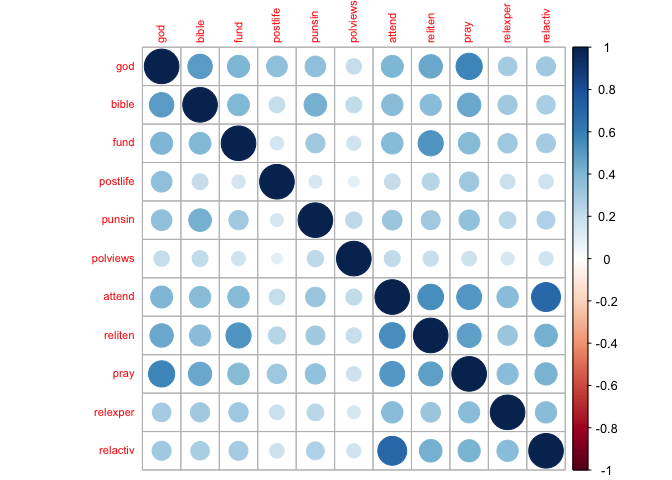
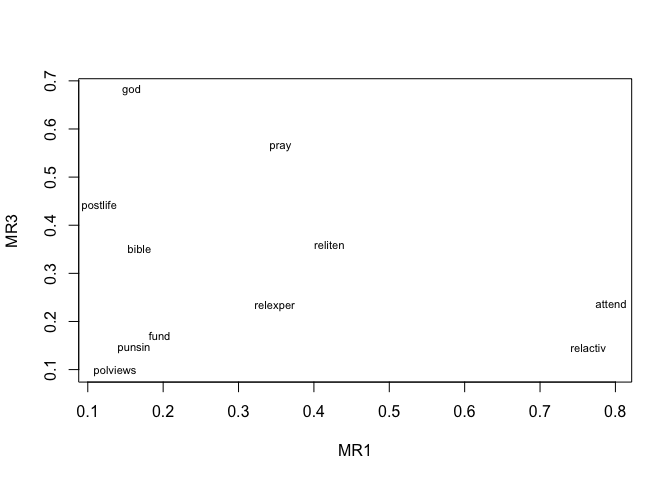

Introduction
------------

The aim of this project is to find a measure of religiosity using the
2006 General Social Survey (GSS) dataset.

Variable Selection
------------------

The following variables from the GSS were selected as relevent for this
study:

**God**. This variable captures respondents' beliefs in the existence of
god on a 6 point scale

**Punsin**. This variable captures respondents' beliefs on whether those
who violate god's rules should be punished on a 4 point scale

**Fund**. This variable captures the fundamentalism of a respondent's
religious belief on a 3 point scale

**Attend**. This varliable captures how often a respondent attends
religious services on an 8 point scale

**Postlife**. This variable captures respondents' belief in an afterlife
on a 3 point scale

**Pray**. This varlaible captures how often a respondent prays to god on
a 6 pointscale

**Bible**. This variable captures how a respondent believes the bible
should be viewed on a 4 pointscale

**Relexper**. This variable captures whether the respondent experienced
a spiritual awakening on a three point scale

**Relactiv**. This variable captures how active a respondent is in
church and related activities

**Polviews**. This variable captures the political views of a respondent
on a 7 point scale

Data Cleaning
-------------

The selected variables were recoded in a consistent manner. Response
categories "missing" and "No answer" were recoded to NA. The variables
were rescaled using the **scale** function.

Results
-------

### The following is the correlation plot of the selected variables:

The data appears to have some structure - we see a degree of
**clustering** in the data. The cluster in the bottom right comprising
of relactiv, relexper, pray, reliten and attend is particularly
prominent.

### The following is the result of the Cronbach's alpha test conducted on the data:

    ## 
    ## Reliability analysis   
    ## Call: alpha(x = gss.religiosity)
    ## 
    ##   raw_alpha std.alpha G6(smc) average_r S/N    ase    mean   sd
    ##       0.84      0.84    0.85      0.32 5.3 0.0035 -0.0034 0.66
    ## 
    ##  lower alpha upper     95% confidence boundaries
    ## 0.83 0.84 0.85 
    ## 
    ##  Reliability if an item is dropped:
    ##          raw_alpha std.alpha G6(smc) average_r S/N alpha se
    ## god           0.82      0.82    0.83      0.31 4.5   0.0040
    ## bible         0.82      0.82    0.83      0.32 4.7   0.0039
    ## fund          0.83      0.83    0.83      0.32 4.8   0.0038
    ## postlife      0.84      0.84    0.85      0.35 5.4   0.0034
    ## punsin        0.83      0.83    0.84      0.33 5.0   0.0037
    ## polviews      0.85      0.85    0.85      0.36 5.6   0.0034
    ## attend        0.82      0.82    0.82      0.31 4.4   0.0041
    ## reliten       0.82      0.82    0.83      0.31 4.5   0.0040
    ## pray          0.82      0.82    0.82      0.31 4.4   0.0040
    ## relexper      0.83      0.83    0.84      0.33 5.0   0.0037
    ## relactiv      0.83      0.83    0.83      0.32 4.7   0.0038
    ## 
    ##  Item statistics 
    ##             n raw.r std.r r.cor r.drop     mean sd
    ## god      2966  0.71  0.71  0.68   0.62 -2.0e-16  1
    ## bible    2943  0.67  0.66  0.62   0.57  1.1e-16  1
    ## fund     4334  0.67  0.63  0.59   0.53 -1.0e-17  1
    ## postlife 2629  0.45  0.45  0.35   0.32 -1.0e-16  1
    ## punsin   2797  0.57  0.57  0.50   0.46 -5.2e-17  1
    ## polviews 4333  0.46  0.41  0.30   0.28 -1.8e-16  1
    ## attend   4491  0.75  0.74  0.74   0.66 -4.0e-17  1
    ## reliten  4469  0.75  0.71  0.69   0.63 -7.2e-17  1
    ## pray     2971  0.74  0.73  0.71   0.66  9.0e-18  1
    ## relexper 2976  0.57  0.57  0.50   0.46 -1.1e-16  1
    ## relactiv 2979  0.65  0.65  0.62   0.55 -4.2e-18  1

The data shows a **high degree of internal consistency**, with a
standardized alpha of 0.84.

### Factor Analysis

Factor analysis was conducted, reducing the variables to 4 factors using
the minimum residuals method. Below are the factor loadings:

    ## 
    ## Loadings:
    ##          MR1   MR3   MR4   MR2  
    ## god      0.158 0.681 0.349 0.184
    ## bible    0.169 0.351 0.543 0.181
    ## fund     0.195 0.170 0.240 0.933
    ## postlife 0.115 0.440            
    ## punsin   0.161 0.146 0.608 0.113
    ## polviews 0.136       0.281      
    ## attend   0.794 0.236 0.243 0.145
    ## reliten  0.421 0.360 0.229 0.352
    ## pray     0.356 0.564 0.305 0.161
    ## relexper 0.348 0.233 0.219 0.157
    ## relactiv 0.764 0.145 0.178      
    ## 
    ##                  MR1   MR3   MR4   MR2
    ## SS loadings    1.789 1.419 1.213 1.159
    ## Proportion Var 0.163 0.129 0.110 0.105
    ## Cumulative Var 0.163 0.292 0.402 0.507

**MR1** accounts for 16%, **MR3** accounts for 13%, **MR4** accounts for
11% and **MR2** accounts for 10.5% of the variance in the data. The four
factors together account for 51% of the variance in the data.

### Interpretation of factors

**MR1**. The loadings for attend, relactiv, reliten, pray and relexper
are high. This factor could represent how actively a respondent
participates in religious practices - does the respondent attend
religious serves? does the respondent participate in church activities?
does the respondent pray regularly? does the respondent see himself as a
strongly religious person?

**MR3**. The loadings for god, bible, postlife, reliten and pray are
high. This factor could represent to what degree a respondent believes
in religious tenets - does the respondent believe in god? does the
respondent view the bible as the word of god? does the respondent see
himself as a strongly religious person?

**MR4**. The loadings for punsin, bible, god and pray are high -
particularly high is the loading for punsin. This factor could represent
whether a respondent believes a person who transgresses a religious norm
should be punished

**MR2**. The loading for fund is very high - 0.933. This factor could
represent whether a respondent is a fundamentalist

### Visualization of factors

    # Extracting factor loadings...
    l <- fa$loadings[,1:2]
    plot(l,type="n")
    text(l,labels=names(gss.religiosity),cex=0.7)

As was noted in the interpretation above, **MR1** ranges from relexper
through reliten and relactiv to attend, indicating that this factor
captures whether a respondent actively participates in religious
activities. **MR3** ranges from punsin through fund, bible and postlife
to god - this factor captures whether a respondent believes in religious
tenets.
